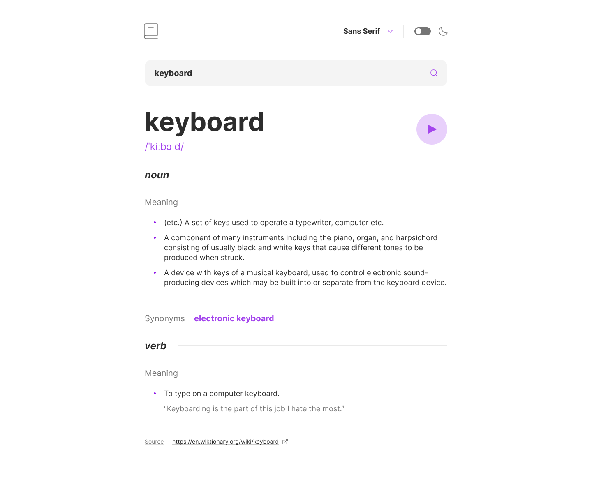
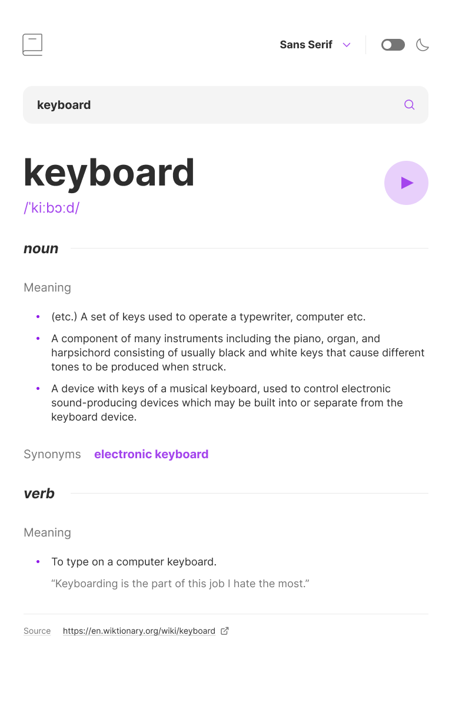
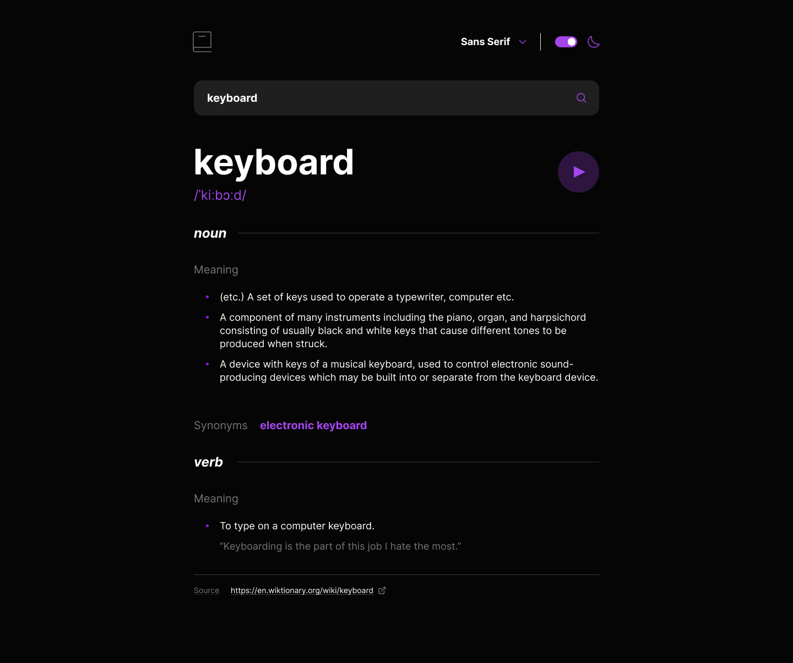
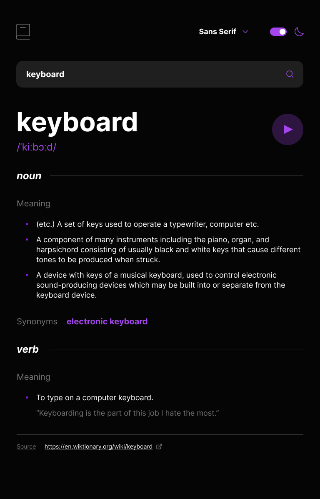

# Dictionary web app solution

This is a solution to the [Dictionary web app challenge on Frontend Mentor](https://www.frontendmentor.io/challenges/dictionary-web-app-h5wwnyuKFL).

## Table of contents

- [Dictionary web app solution](#dictionary-web-app-solution)
  - [Table of contents](#table-of-contents)
  - [Overview](#overview)
    - [The challenge](#the-challenge)
    - [Screenshot](#screenshot)
    - [Links](#links)
  - [My process](#my-process)
    - [Built with](#built-with)
    - [What I learned](#what-i-learned)
    - [Useful resources](#useful-resources)
  - [Author](#author)

## Overview

### The challenge

Users should be able to:

- [x] Search for words using the input field
- [x] See the Free Dictionary API's response for the searched word
- [ ] See a form validation message when trying to submit a blank form
- [ ] Play the audio file for a word when it's available
- [x] Switch between serif, sans serif, and monospace fonts
- [x] Switch between light and dark themes
- [x] View the optimal layout for the interface depending on their device's screen size
- [x] See hover and focus states for all interactive elements on the page
- [x] **Bonus**: Persist chosen theme and font for next visits.
- [ ] **Bonus**: Have the correct color scheme chosen for them based on their computer preferences. _Hint_: Research `prefers-color-scheme` in CSS.

### Screenshot

*Desktop Light theme with Sans font*

*Mobile Light theme with Sans font*

*Desktop Dark theme with Sans font*

*Mobile Light theme with Sans font*

### Links

- Solution URL: [This Repo](https://github.com/stgonzales/dictionary-web-app)
- Live Site URL: [Dictionary web app solution](https://dictionary-web-app-two-beryl.vercel.app/)

## My process

### Built with

- [Solidjs](https://www.solidjs.com/) - Simple and performant reactivity for building user interfaces
- [Vite](https://vitejs.dev/) - Frontend Tooling
- [Tailwindcss](https://tailwindcss.com/) - For styles

### What I learned

In this project I was able to understand some of the concepts of [Solidjs](https://www.solidjs.com/) - how to create and use context, how to use signals and [Solijs helper components](https://www.solidjs.com/docs/latest/api#control-flow), also traing more about [Tailwindcss](https://tailwindcss.com/) dark mode.

### Useful resources

- [Official SolidJs Documentation](https://www.solidjs.com/docs/latest/api)
- [Official Tailwindcss Documentation](https://tailwindcss.com/docs/installation)

## Author

- Github - [@stgonzales](https://github.com/stgonzales)
- LinkedIn - [Stephen Goncalves](https://www.linkedin.com/in/stephgoncalves/)
- Frontend Mentor - [@stgonzales](https://www.frontendmentor.io/profile/stgonzales)
